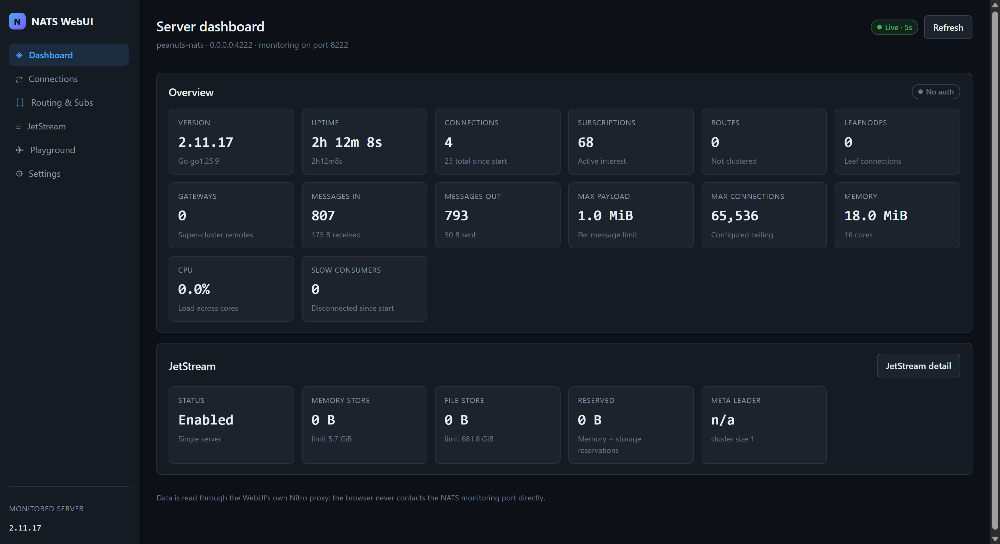
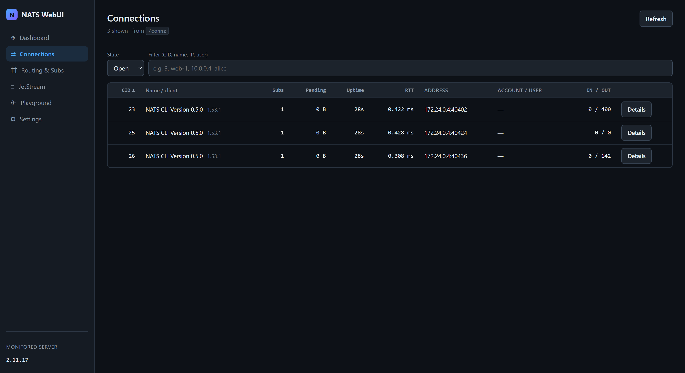
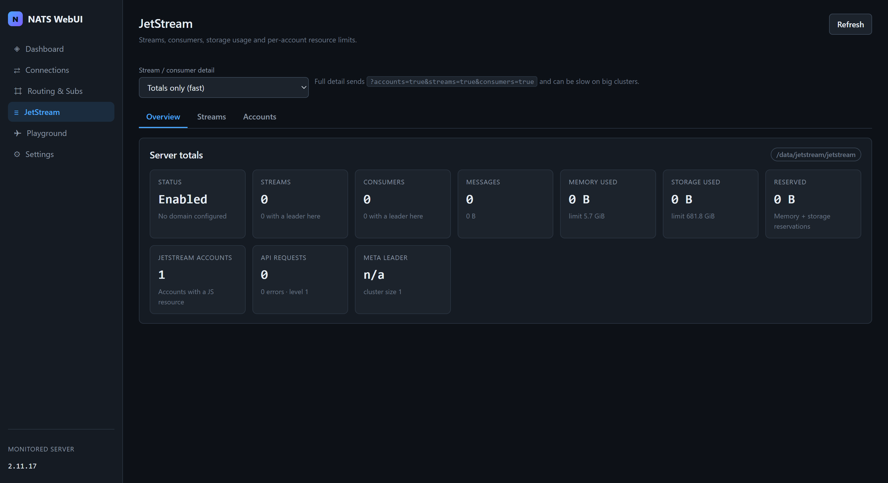
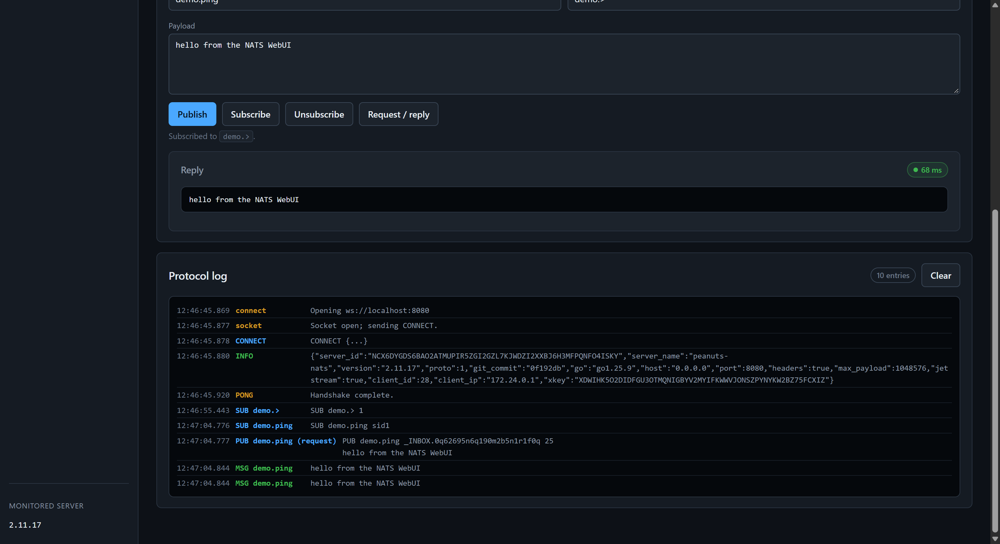

# nats-webui

A self-hosted web UI for a [NATS](https://github.com/nats-io/nats-server)
server — live monitoring, a JetStream overview, and a publish / request-reply
playground, in one container that runs next to the server.

[](https://github.com/techbuzzz/nats-webui/actions/workflows/ci.yml)
[](https://github.com/techbuzzz/nats-webui/pkgs/container/nats-webui)
[](./LICENSE)



## What it does

- **Monitoring, normalized.** `/varz`, `/connz`, `/subsz`, `/routez`, `/leafz`,
  `/gatewayz` — parsed and coerced server-side into strict view models, so a
  field that NATS omitted renders as "—" instead of breaking a table.
- **JetStream overview.** Server totals, API totals, memory vs. file storage, and
  a per-account breakdown of streams and consumers. Handles both JetStream
  payload shapes (the pre-2.11 boolean and the modern object).
- **A real playground.** Publish, subscribe, and request/reply over the NATS
  WebSocket, with the raw protocol frames in a side log and live connection
  state — not a mock console.
- **The monitoring port stays internal.** The browser never calls `:8222`. A
  Nitro proxy does it server-side, so basic-auth and bearer tokens live in
  server environment variables and never cross to the page.
- **Read-only by default.** Non-root container, read-only root filesystem,
  `cap_drop: ALL`, `no-new-privileges`, and a `/api/health` endpoint.
- **100 tests over the parts that break quietly.** Normalizers, the NATS wire
  codec, query sanitization, and every failure path of the monitoring API.

## Positioning: how this compares to `nats-surveyor`

`nats-io/nats-surveyor` already exists and is a better choice in several cases.
It is Apache-2.0, has roughly 331 stars, is actively maintained, and ships as a
single Go binary next to the NATS server.

**Use Surveyor if** you want monitoring with no Node runtime and no frontend
build, if you want its embedded dashboard as-is, or if your deployment already
standardises on the wider `nats-io` tooling.

**This project is different in three concrete ways:**

1. **A playground, not just monitoring.** Surveyor shows you the server's state.
   nats-webui lets you publish, subscribe and issue requests against it, with the
   protocol log visible, so you can see the actual frames. That is the debugging
   half of NATS, and the monitoring endpoint cannot provide it.
2. **Normalized view models.** Raw monitoring JSON is parsed into strict types
   server-side, so UI differences between NATS versions are absorbed in one
   place (`shared/utils/normalize.ts`) rather than in every component.
3. **Shipped as a web UI you can extend.** If your team wants to add a view, it is
   Vue components over an existing typed proxy — not a fork of a Go binary.

**It is not a Surveyor replacement**, and it does not try to be. If you want
monitoring, Surveyor is the more mature and the simpler answer.

## Quick start

The single command — NATS and the WebUI on one network, nothing to configure:

```bash
git clone https://github.com/techbuzzz/nats-webui.git
cd nats-webui
docker compose up -d
```

Open <http://localhost:3000>.

Verify:

```bash
docker compose ps
curl -s http://localhost:3000/api/health
curl -s http://localhost:3000/api/monitor/varz
```

Stop / remove:

```bash
docker compose down          # keep the JetStream volume
docker compose down -v       # also delete JetStream data
```

### Prebuilt image

The `Docker` workflow publishes a multi-arch (`linux/amd64`, `linux/arm64`) image
to GHCR. **Only a semver tag publishes an image** — pushing `v1.2.3` publishes
`1.2.3`, `1.2` and `1`.

```bash
docker pull ghcr.io/techbuzzz/nats-webui:1
```

A push to `main` builds the image for both architectures and verifies it, then
discards it: an untagged commit never gets a name, and there is deliberately no
`latest` alias for one to hijack. Per-commit image verification happens on every
pull request in the `compose` job of the `CI` workflow.

To run it alongside an existing NATS server, override the runtime variables (see
[Configuration](#configuration) below); the image needs no rebuild.

### Pointing it at an external NATS server

Change the server-side variables in `docker-compose.yml` (or your orchestrator)
and restart — everything is runtime configuration:

```yaml
environment:
  NUXT_NATS_MONITOR_URL: "http://nats.prod.internal:8222"
  NUXT_NATS_MONITOR_USER: "monitor"
  NUXT_NATS_MONITOR_PASSWORD: "${NATS_MONITOR_PASSWORD}"
  NUXT_PUBLIC_NATS_WS_URL: "wss://nats.example.com:443"
```

Two rules of thumb:

- `NUXT_NATS_MONITOR_URL` is resolved **inside the container network**. A
  Docker-internal hostname such as `nats` works between containers but is
  unreachable from a laptop.
- `NUXT_PUBLIC_NATS_WS_URL` is resolved **by the browser**, so it cannot be an
  internal hostname.

The target server needs `http_port: 8222` for monitoring and a `websocket {}`
block for the playground.

## Features

| View               | Endpoint(s)                                    | What it shows                                                                 |
| ------------------ | ---------------------------------------------- | ----------------------------------------------------------------------------- |
| Dashboard          | `/varz`                                        | version, uptime, host/port, connections, routes/leafnodes/gateways, subscriptions, `max_payload`, auth flag, JetStream usage, CPU/memory |
| Connections        | `/connz`                                       | sortable + filterable table (CID, name, IP:port, subs, pending bytes, uptime, RTT) |
| Connection detail  | `/connz?cid=N`                                 | full session stats and the client's subscription list                          |
| Routing & Subs     | `/routez`, `/subsz`, `/leafz`, `/gatewayz`      | tabbed; sublist cache stats for `/subsz`                                      |
| JetStream          | `/jsz`, `/accountz`                            | server totals, API totals, memory vs file storage, per-account streams and consumers |
| Playground         | NATS WebSocket                                 | publish, subscribe, request/reply with raw protocol log and live connection state |
| Settings           | —                                              | point the browser at a different NATS server; persists to browser storage      |







> Note: the subscription endpoint is **`/subsz`**, not `/subz`. This trips up a
> lot of third-party articles; the WebUI always calls the real path.

## Architecture

```text
                        ┌───────────────────────────────────────────────┐
                        │  docker network                              │
   ┌──────────┐  HTTP   │                                               │
   │ Browser  │────────▶│  webui  (Nuxt 4 + Nitro,  :3000)             │
   │          │◀────────│        │                                      │
   └──────────┘  HTML   │        │  1. /api/monitor/**  ──▶ GET /varz,   │
     │                 │        │                       /connz, /subsz, │
     │   WSS :8080     │        │                       /routez, /jsz…  │
     │  (playground)   │        │                       (no CORS issue: │
     │                 │        │                        the browser     │
     │                 │        │                        never calls     │
     │                 │        │                        :8222 directly)  │
     │                 │        ▼                                      │
     │                 │  nats  (nats-server)                          │
     │                 │     :4222  client port                        │
     │                 │     :8080  websocket  ◀── browser WSS         │
     │                 │     :8222  monitoring (internal only)         │
     │                 │     jetstream → /data volume                 │
     │                 └───────────────────────────────────────────────┘
```

Two independent data paths, by design:

| Path       | Browser → …                                    | Why                                                   |
| ---------- | ---------------------------------------------- | ----------------------------------------------------- |
| Monitoring | `/api/monitor/*` (Nitro) → NATS `:8222`         | keeps `:8222` internal, no CORS, one auth surface     |
| Playground | `ws://…:8080` (WebSocket) → NATS `:8080`         | publish/request is not a monitoring concern           |

### Why a Nitro proxy instead of calling `:8222` from the browser

- **No CORS dependency.** The monitoring endpoint's CORS/JSONP support is a
  server-side implementation detail and is not guaranteed across versions;
  proxying removes the question entirely.
- **The internal address stays internal.** `:8222` is not published in
  `docker-compose.yml`, so the browser cannot address it even if it wanted to.
- **Credentials never reach the page.** Monitoring basic-auth/token live in
  server env only. `/api/config` returns just the WebSocket URL.
- **One typed, normalized contract.** Raw monitoring JSON is parsed and
  normalized server-side into strict view models (`shared/types/monitoring.ts`),
  so components never deal with missing fields.

### Data flow

1. A page calls `useMonitoring('/api/monitor/varz')`.
2. Nitro's route resolves config through `server/utils/nats-config.ts`,
   sanitizes the query, fetches the monitoring endpoint with a timeout, and
   normalizes the payload.
3. The page renders strict view models, or a `DataState` failure block carrying
   `{ kind, message, hint }` — never a raw stack trace.

## Configuration

All configuration is **runtime** environment configuration — no rebuild is
needed to change it.

| Variable                           | Default               | Scope  | Purpose                                                    |
| ---------------------------------- | --------------------- | ------ | ---------------------------------------------------------- |
| `NUXT_NATS_MONITOR_URL`            | `http://nats:8222`    | server | Base URL of the NATS monitoring endpoint                   |
| `NUXT_NATS_MONITOR_USER`           | _(empty)_             | server | HTTP basic-auth user for the monitoring endpoint           |
| `NUXT_NATS_MONITOR_PASSWORD`       | _(empty)_             | server | HTTP basic-auth password                                   |
| `NUXT_NATS_MONITOR_TOKEN`          | _(empty)_             | server | Bearer token; takes precedence over basic auth            |
| `NUXT_NATS_MONITOR_TIMEOUT_MS`     | `8000`                | server | Timeout for monitoring calls                               |
| `NUXT_NATS_CLIENT_URL`             | `nats://nats:4222`    | server | Client port, for diagnostics only                          |
| `NUXT_PUBLIC_NATS_WS_URL`          | `ws://localhost:8080` | client | WebSocket URL the **browser** connects to for the playground |
| `NUXT_PUBLIC_NATS_CONNECTION_NAME` | `nats-webui`          | client | Connection name advertised in the NATS `CONNECT` frame     |
| `NITRO_PORT` / `NITRO_HOST`        | `3000` / `0.0.0.0`    | server | Where the WebUI listens                                    |

### Per-browser overrides (Settings page)

The Settings page overrides the playground connection for the current browser
only. The Nitro proxy always uses the server-side configuration.

- Non-secret values (URL, connection name, username) → `localStorage`
- Password / auth token → `sessionStorage` by default
- Only if *Remember the password and token in this browser* is checked do they
  move to `localStorage`, in plain text. Treat that as a deliberate trade-off on
  trusted machines only.

## Security posture

- **Non-root container.** The runtime stage runs as the `node` user.
- **No secrets in the image or repo.** All credentials come from environment
  variables; nothing is baked at build time. No secret is ever logged — the
  protocol log writes `CONNECT {...}` rather than the real frame.
- **Read-only container.** `read_only: true` with a `tmpfs` on `/tmp`,
  `cap_drop: ALL`, `no-new-privileges`.
- **Monitoring port not published.** Only `4222` and `8080` reach the host, so
  the unauthenticated monitoring endpoint is not exposed.
- **Query allowlist.** `/api/monitor/**` forwards only declared, type-coerced
  parameters (`sanitizeQuery`), so arbitrary parameters cannot be relayed
  upstream.
- **No CORS surface.** The browser only ever talks to the WebUI's own origin.

> The NATS **client** port and **WebSocket** port are published without
> authentication in the default compose file, which is fine for local development
> and wrong for anything else. Enable NATS authentication (`authorization {}`
> with a user or token) and set credentials in the Settings page before exposing
> them. The WebUI itself has no authentication: terminate it in front, or bind
> it to an internal network. See [SECURITY.md](./SECURITY.md) for how to report
> a vulnerability.

## Testing

```bash
npm test
```

100 tests over 5 files, covering:

- **`tests/normalize.spec.ts`** — every monitoring normalizer against realistic
  payloads, including the two JetStream shapes (pre-2.11 boolean vs. modern
  object) and empty-payload degradation.
- **`tests/normalize-primitives.spec.ts`** — coercion helpers and Go duration
  parsing (`1h2m3s`, `1.234ms`, `250us`).
- **`tests/nats-protocol.spec.ts`** — the NATS wire codec: frame encoding,
  byte-accurate payload lengths, incremental reassembly across chunk boundaries,
  `MSG`/`HMSG`/`INFO`/`-ERR` decoding.
- **`tests/api-route.spec.ts`** — the `/api/monitor/**` route behaviour: query
  sanitization, normalization, and every failure mode mapped to an HTTP status
  with an actionable hint.
- **`tests/nats-config.spec.ts`** — URL construction, auth header selection, the
  public-config guarantee that credentials never cross to the client, and
  formatting helpers.

The other three checks CI runs:

```bash
npm run lint        # eslint, flat config via @nuxt/eslint, type-aware
npm run typecheck   # vue-tsc, strict
npm run build       # production Nitro build into .output/
```

## Project layout

```text
├── app/                        # Vue app (Nuxt 4 srcDir)
│   ├── components/             # DataState, StatTile, DefinitionRow, ConnectionStatusBadge
│   ├── composables/            # useMonitoring, usePolling, useNatsConnection, useConnectionSettings
│   ├── pages/                  # index, connections, routing, jetstream, playground, settings
│   ├── layouts/default.vue     # sidebar shell
│   └── assets/css/main.css     # design tokens and component styles
├── server/
│   ├── api/monitor/            # varz, connz, subsz, routez, leafz, gatewayz, jsz, accountz
│   ├── api/config.get.ts       # non-secret client config
│   ├── api/health.get.ts       # liveness + NATS reachability
│   └── utils/                  # nats-config, nats-monitoring, monitoring-route
├── shared/                     # used by BOTH bundles (no Vue, no Nitro imports)
│   ├── types/nats-wire.ts      # raw payload shapes
│   ├── types/monitoring.ts     # strict normalized view models
│   └── utils/                  # normalize, format, api-error, nats-protocol
├── tests/                      # vitest suites
├── nats/nats-server.conf       # NATS config for the sidecar (websocket block)
├── docs/screenshots/           # real captures of a running stack
├── Dockerfile                  # multi-stage: deps → build → runtime (node user)
└── docker-compose.yml          # nats + webui on one network
```

## Roadmap

Not implemented yet, in rough priority order:

- **KV / Object Store browsing** — reachable through the JetStream API
  (`$JS.API.STREAM.*`), not the monitoring endpoint. Adding them means a
  JetStream API client in the Nitro layer plus its own types; the normalizer and
  page scaffolding here would carry over directly.
- **Diff view / time series** — the dashboard polls every 5 s but discards
  history; a ring buffer would allow sparklines and restart detection.
- **Per-endpoint latency and error counters** from `http_req_stats` in `/varz`.
- **Publish/inspect over the monitoring-free JetStream API** for stream creation
  and consumer configuration.
- **Authentication for the WebUI itself** (e.g. `nuxt-auth-utils`) so the
  sidecar is not open to anyone who can reach port 3000.

Contributions welcome — see [CONTRIBUTING.md](./CONTRIBUTING.md).

## License

**Apache-2.0.** See [LICENSE](./LICENSE).

Third-party components keep their own licenses: NATS (Apache-2.0), Nuxt and Vue
(MIT).